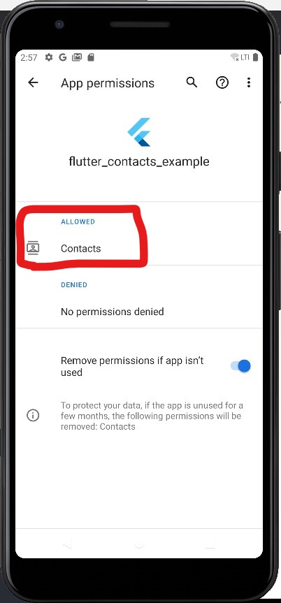
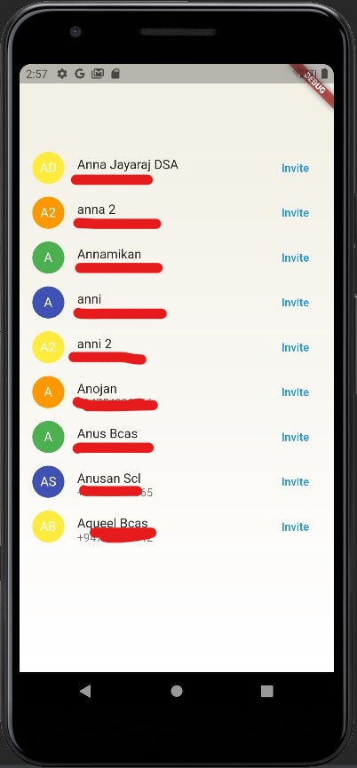

# CONTACTS PROTOTYPE FLUTTER

## Introduction

A simple contact access sample project in Flutter, accessing the contacts in mobile phone could be a tricky part, this prototype could be used as a boilerplate code to achieve this task easily.

## Technology & Frameworks
- Flutter 2.8.1
- Dart 2.15.1
- contacts_service: ^0.6.3
- permission_handler: ^8.3.0    

### Why contacts_service?

This is the major package that gives access to the contacts.

### Why permission_handler?

This package is used to handle permissions for contacts accesses.

## Configuration and Setup

- Turn on contact access to this app after installation.

## Demo

# CONTACT

### Website: 

### Social Media:

